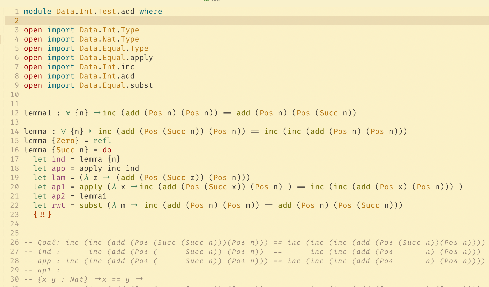

# Agda-vim
Syntax file highlight for Agda

## Installation

### On NeoVim
Clone this repo and past the file "Agda.vim" into `~/.config/nvim/syntax/Agda.vim` and add in your `init.vim` file the next line:

#### On NeoVim
Clone this repo and past the folder "syntax" into `~/.config/nvim/` and add in your `init.vim` file the next line:

### On VIM
Clone this repo and past the file "Agda.vim" into `~/.vim/syntax/Agda.vim` and add in your `.vimrc` file the next line:

```vim
au BufRead,BufNewFile *.Agda set filetype=Agda
au BufNewFile,BufRead *.Agda set syntax  =Agda
```

## Preview

